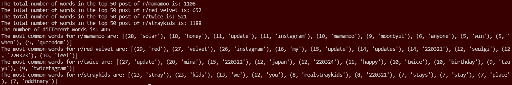

# Project Writeup and Reflection

### 1. Project Overview
**For this assignment, I used data sources from different subreddit of Reddit, including r/mamamoo (my main observing target), r/red_velvet, r/straykids, and r/twice. I began the process by using a histogram function to create a dictionary of words in the top 50 post from mamamoo, and I used different summary statistics to summarize the main topics in the subreddit currently. Additionally, I also used NLTK sentiment analysis to analyze the overall, or the average, positivity or neutrality of the posts. Lastly, I used the text similarity technique (fuzzywuzzy library) to find the similarity between the k-pop group Mamamoo, and other k-pop groups like Red Velvet (which has different audience), Twice (which has very different style), and Stray Kids (which is a boy's group). By comparing them, I hope to find whether or not their audience has different behaviors or reactions towards the group, when the k-pop groups have different style and gender.**

### 2. Implementation
**First, I created a config file where I store my client ID and other confidential information inside that file, so that I don't have to push it on to Github a risk other people stealing my account. I used my client ID and other information log access information from reddit, which I can use to analyze. I also have a txt file, where I store all the irrelevant words that are not important in the process of identifying the hot topics of the subreddit. I found the total number of words for each of the subreddit of the k-pop group that I'm looking into because I believe it will show me some information related to whether or not the groups are active. I also looked into the most common words for each of the subreddit because they will give me the information on recent activity of the k-pop groups.**

**On the second part, I utilizes NLTK sentiment analysis to look into the overall mood of the subreddit, currently. I feel like the sentiment analysis part would be useful because fandoms are usually full of different moods and feelings going around in conversation. So having a sentiment analysis on r/mamamoo will help me understand more about the current activity of the k-pop group. I had a small problem while doing this part of the analysis, which is downloading the required library. I managed to resolve this problem by both using Google and asking Professor Li for help. For the sentiment function, I created a list for each of the components in the sentiment analysis (neg, neu, pos, compound). The reason for that is because I am collecting "mood" from each of the post for the top 50 posts for the week, and it will be better if I collect each of them independently and average them out. Since I'm also going to work on a lot of averaging lists, so I created a function that will give me the average of the numbers in the list, so I could use it in multiple places like sentiment analysis and text similarity analysis. I also did a little bit of research on what each of the element mean in sentiment analysis and I managed to get answer from [this website.](https://medium.com/analytics-vidhya/sentiment-analysis-with-nltk-textblob-and-flair-a321d1460867) It helps me understand that neg = negativity, pos = positivity, neu = neutrality, and compound = +1 means it's most extreme positive while -1 means it's most extreme negative.**

**For the third part, I did a text similarity analysis using the fuzzywuzzy library. I ran into a problem while installing the fuzzywuzzy library, and I used reddit to help me indentify the problem, and successfully install the library. I decided to compare the similarity of posts for Mamamoo and three other k-pop groups. I created a function add_to_list, so that I can have each of the kpop group's top 50 posts of the week as a separate list and analyze the similarity by comparing them. I also used [this website](https://pypi.org/project/fuzzywuzzy/) to help me understand the different funtion in text similarity technique.**

### 3. Results
**In the end**

### 4. Reflection
****