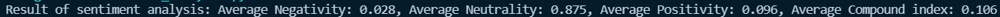
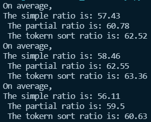

# Project Writeup and Reflection

### 1. Project Overview
**For this assignment, I used data sources from different subreddit of Reddit, including r/mamamoo (my main observing target), r/red_velvet, r/straykids, and r/twice. I began the process by using a histogram function to create a dictionary of words in the top 50 post from mamamoo, and I used different summary statistics to summarize the main topics in the subreddit currently. Additionally, I also used NLTK sentiment analysis to analyze the overall, or the average, positivity or neutrality of the posts. Lastly, I used the text similarity technique (fuzzywuzzy library) to find the similarity between the k-pop group Mamamoo, and other k-pop groups like Red Velvet (which has different audience), Twice (which has very different style), and Stray Kids (which is a boy's group). By comparing them, I hope to find whether or not their audience has different behaviors or reactions towards the group, when the k-pop groups have different style and gender.**

### 2. Implementation
**First, I created a config file where I store my client ID and other confidential information inside that file, so that I don't have to push it on to Github a risk other people stealing my account. I used my client ID and other information log access information from reddit, which I can use to analyze. I also have a txt file, where I store all the irrelevant words that are not important in the process of identifying the hot topics of the subreddit. I found the total number of words for each of the subreddit of the k-pop group that I'm looking into because I believe it will show me some information related to whether or not the groups are active. I also looked into the most common words for each of the subreddit because they will give me the information on recent activity of the k-pop groups.**

**On the second part, I utilizes NLTK sentiment analysis to look into the overall mood of the subreddit, currently. I feel like the sentiment analysis part would be useful because fandoms are usually full of different moods and feelings going around in conversation. So having a sentiment analysis on r/mamamoo will help me understand more about the current activity of the k-pop group. I had a small problem while doing this part of the analysis, which is downloading the required library. I managed to resolve this problem by both using Google and asking Professor Li for help. For the sentiment function, I created a list for each of the components in the sentiment analysis (neg, neu, pos, compound). The reason for that is because I am collecting "mood" from each of the post for the top 50 posts for the week, and it will be better if I collect each of them independently and average them out. Since I'm also going to work on a lot of averaging lists, so I created a function that will give me the average of the numbers in the list, so I could use it in multiple places like sentiment analysis and text similarity analysis. I also did a little bit of research on what each of the element mean in sentiment analysis and I managed to get answer from [this website.](https://medium.com/analytics-vidhya/sentiment-analysis-with-nltk-textblob-and-flair-a321d1460867) It helps me understand that neg = negativity, pos = positivity, neu = neutrality, and compound = +1 means it's most extreme positive while -1 means it's most extreme negative.**

**For the third part, I did a text similarity analysis using the fuzzywuzzy library. I ran into a problem while installing the fuzzywuzzy library, and I used reddit to help me indentify the problem, and successfully install the library. I decided to compare the similarity of posts for Mamamoo and three other k-pop groups. I created a function add_to_list, so that I can have each of the kpop group's top 50 posts of the week as a separate list and analyze the similarity by comparing them. I also used [this website](https://pypi.org/project/fuzzywuzzy/) to help me understand the different funtion in text similarity technique.**

### 3. Results
**To begin with, I did a text summary analysis, and I round out that r/mamamoo and r/straykids have a lot more total number of words in their top50 post compare to r/red_velvet and r/twice. As shown in the image below:**

**I think the reason for this is because Mamamoo and Straykids recently has a comeback, or one of their member has a comeback. That means there are a lot of things for the fans to discuss about, like costumes, MV, music, stage, and etc. In addition, I also looked at the most common words for the four k-pop groups, and I found out that for Red Velvet and Twice, who didn't recently had a comeback, the fans focused on memebers' "instagram updates." While for Straykids and Mamamoo, the fans focused more on talking about the most recent album ('honey' and 'oddinary').**

**For the sentiment analysis I received the following result:**

**We can see that the average negativity is low for the top 50 posts, so it means that the mood on average for the new comeback is low on negativity. This means that Solar is doing pretty well with her new album 'Honey', and I'm really happy for her. The average neutrality is really high, with a 0.875, and I think that is because a lot of the posts are about updating instagram posts from Instagram to Reddit, and updating the most recent stage for other fans to see, e.g. Solarsio Update (220326). The average positivity does not seem too high, but it's still relatively higher than negativity, meaning that there are more positivity within the fans about recent events or activities of the members of Mamamoo. Lastly, the compound index is 0.106, which is not too bad consider that it can also be extreme negative of -1. The result shows that the fans have more of a positive reaction rather than a negative reaction to recent members or fans activities.**

**Last but not least, the text similarity analysis shows me the following result:**

**The first result (top four rows) illustrates the result from comparing r/mamamoo top 50 posts to r/red_velvet top 50 posts. The second result demonstrates the result from comparing r/mamamoo to r/twice, and the last result demonstrates the result from comparing r/mamamoo to r/straykids. Unfortunately, if you look at the collectively, you can not find any differences between them, which is not the result that I expected. However, despite that all three are k-pop groups, and the fans base are kind of similar because usually if you listen to one k-pop group, you will also be involved with other k-pop groups. Therefore, it did explain why it yiels a similar result for all three comparisons.**

### 4. Reflection
**From a process point of view, I think I did achieve what I wanted by using text summary, text similarity and sensitive analysis. Although it took me a long time to learn the sentiment analysis and text similarity, as well as get them working, I did learn a lot on how to do text analysis in the future. However, I think I can work on adding text clusterity next time. I thought it is unnecessary this time because the text similarity did not show much differences, but I could definitely use it next time for a different project.**

**I think for a person that just started doing projects for text analysis, my project was appropriately scoped. It gave me enough information to understand and have a glimpse of what text analysis is kind of about, and what I can do with it. Going forward, I can focus on learning more advanced techniques of text analysis, and I'm especially interested in learning about NLTK, as well as training classifier to do text analysis.**